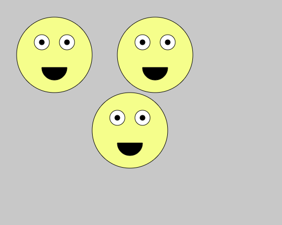

# Functions

We have solved a lot of problems in this course using code. To quickly use code again, we use functions. Functions are a named group of programming instructions. Functions are reusable abstractions that reduce the complexity of writing and maintaining programs. Essentially, they are a way in which to "box up" a solution to a problem so that we can use it when the problem arises again.

A simple function syntax with a parameter looks like:

```js
// defining a function with a parameter of name
function myFunc(name){
  console.log("hello " + name)
}

// calling a function with arguemnt of "Taylor"
myFunc("Taylor") // Prints "hello Taylor"
```

## Tasks
1. Create a `drawHappyFace` function. Place the happy face code inside. Call the function inside the draw loop.


2. Draw a simple ellipse on the screen that will change as the keys are pressed. Write a function to:
- Respond to left, right, up, and down arrow clicks. 
- Have the ellipse reappear on the other side of the screen if it goes off the edge.


3. Modify the `drawHappyFace()` function so that it accepts any x and y value and places the face that the specified position.



4. Get each face to move when different sets of arrow are clicked. For example, have one controlled by a/s/d/w keys and another controlled by arrow keys.


5. The smiley faces are under attack! Right a `drawEnemy()` function that accepts the amount of aliens to draw and then draws them on the screen in a random position. **HINT**: Start by getting one alien to draw 

